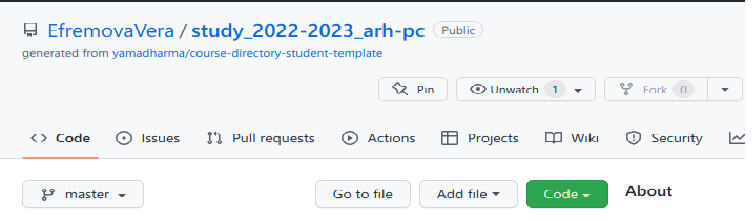

---
## Front matter
title: "Отчёт по лабораторной работе 2"
subtitle: "Простейший вариант"
author: "Ефремова Вера"

## Generic otions
lang: ru-RU
toc-title: "Содержание"

## Bibliography
bibliography: bib/cite.bib
csl: pandoc/csl/gost-r-7-0-5-2008-numeric.csl

## Pdf output format
toc: true # Table of contents
toc-depth: 2
lof: true # List of figures
lot: true # List of tables
fontsize: 12pt
linestretch: 1.5
papersize: a4
documentclass: scrreprt
## I18n polyglossia
polyglossia-lang:
  name: russian
  options:
	- spelling=modern
	- babelshorthands=true
polyglossia-otherlangs:
  name: english
## I18n babel
babel-lang: russian
babel-otherlangs: english
## Fonts
mainfont: PT Serif
romanfont: PT Serif
sansfont: PT Sans
monofont: PT Mono
mainfontoptions: Ligatures=TeX
romanfontoptions: Ligatures=TeX
sansfontoptions: Ligatures=TeX,Scale=MatchLowercase
monofontoptions: Scale=MatchLowercase,Scale=0.9
## Biblatex
biblatex: true
biblio-style: "gost-numeric"
biblatexoptions:
  - parentracker=true
  - backend=biber
  - hyperref=auto
  - language=auto
  - autolang=other*
  - citestyle=gost-numeric
## Pandoc-crossref LaTeX customization
figureTitle: "Рис."
tableTitle: "Таблица"
listingTitle: "Листинг"
lofTitle: "Список иллюстраций"
lotTitle: "Список таблиц"
lolTitle: "Листинги"
## Misc options
indent: true
header-includes:
  - \usepackage{indentfirst}
  - \usepackage{float} # keep figures where there are in the text
  - \floatplacement{figure}{H} # keep figures where there are in the text
---

# Цель работы

Целью работы является изучить идеологию и
применение средств контроля версий. Приобрести
практические навыки по работе с системой git.

# Теоретическое введение

Здесь описываются теоретические аспекты, связанные с выполнением работы.

Например, в табл. [-@tbl:std-dir] приведено краткое описание стандартных каталогов Unix.

: Описание некоторых каталогов файловой системы GNU Linux {#tbl:std-dir}

| Имя каталога | Описание каталога                                                                                                          |
|--------------|----------------------------------------------------------------------------------------------------------------------------|
| `/`          | Корневая директория, содержащая всю файловую                                                                               |
| `/bin `      | Основные системные утилиты, необходимые как в однопользовательском режиме, так и при обычной работе всем пользователям     |
| `/etc`       | Общесистемные конфигурационные файлы и файлы конфигурации установленных программ                                           |
| `/home`      | Содержит домашние директории пользователей, которые, в свою очередь, содержат персональные настройки и данные пользователя |
| `/media`     | Точки монтирования для сменных носителей                                                                                   |
| `/root`      | Домашняя директория пользователя  `root`                                                                                   |
| `/tmp`       | Временные файлы                                                                                                            |
| `/usr`       | Вторичная иерархия для данных пользователя                                                                                 |

Более подробно об Unix см. в [@gnu-doc:bash;@newham:2005:bash;@zarrelli:2017:bash;@robbins:2013:bash;@tannenbaum:arch-pc:ru;@tannenbaum:modern-os:ru].

# Выполнение лабораторной работы

2.4.1. Настройка github
Создадим учётную запись на сайте https://gitfhub.com/ и заполним
основные данные. Указано на рис. [-@fig:001]

2.4.2. Базовая настройка git
Сначала сделаем предварительную конфигурацию git. Откроем
терминал и введём команды(git config --global), указав имя и email
владельца репозитория. Настроим utf-8 в выводе сообщений git.
Зададим имя начальной ветки и назовём её master. Напишем
параметры autocrlf и safecrlf. Указано на рис. [-@fig:002]

2.4.3. Создание SSH ключа
Для последующей идентификации пользователя на сервере
репозиториев необходимо сгенерировать пару ключей(приватный и
открытый) и скопируем его из локальной консоли ключ в буфер
обмена. Вставляем ключ на сайте в поле и указываем для ключа имя.
Указано на рис. [-@fig:003]

2.4.4. Создание рабочего пространства и
репозитория курса на основе шаблона
Будем придерживаться следующей структуры каталогов.
Указано на рис. [-@fig:004]
Создадим каталог предмета «Архитектура компьютера» с помощью
команды mkdir.

2.4.5. Создание репозитория курса на основе
шаблона
Репозиторий на основе создадим через web-интерфейс github.
Перейдём на страницу репозитория с шаблонами курса и выберем
Use this template. Зададим имя репозитория study_2022–2023_arh-pc
и создадим репозиторий. Указано на рис. [-@fig:005]

Откроем терминал и перейдём в каталог курса. Клонируем
созданный репозиторий. Указано на рис. [-@fig:006]

2.4.6. Настройка каталога курса
Перейдём в каталог курса и удалим лишние файлы с помощью
команды rm. Указано на рис. [-@fig:007]
Создадим необходимые каталоги и отправим на сервер. Проверим
правильность создания иерархии на сайте. Указано на рис. [-@fig:008] 

Создадим отчёт по выполнению работы в каталоге рабочего
пространства в lab01 и lab02. Загрузим файлы на github.

{ #fig:001 width=70% }
{ #fig:001 width=70% }
{ #fig:001 width=70% }
{ #fig:001 width=70% }
{ #fig:001 width=70% }
{ #fig:001 width=70% }
{ #fig:001 width=70% }
{ #fig:001 width=70% }

# Выводы

Была изучена идеология и применение средств контроля версий,
были приобретены практические навыки по работе с системой git, а
также по работе сайте https://github.com/

::: {#refs}
:::
