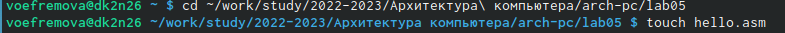
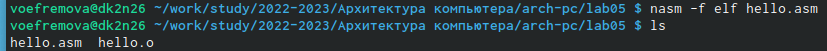
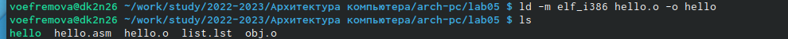
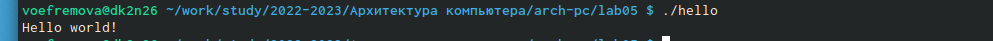
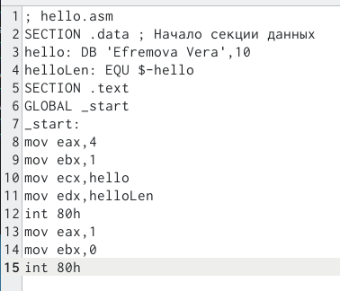

---
## Front matter
title: "Отчёт по лабораторной работе №4"
author: "Ефремова Вера"

## Generic otions
lang: ru-RU
toc-title: "Содержание"

## Bibliography
bibliography: bib/cite.bib
csl: pandoc/csl/gost-r-7-0-5-2008-numeric.csl

## Pdf output format
toc: true # Table of contents
toc-depth: 2
lof: true # List of figures
lot: true # List of tables
fontsize: 12pt
linestretch: 1.5
papersize: a4
documentclass: scrreprt
## I18n polyglossia
polyglossia-lang:
  name: russian
  options:
	- spelling=modern
	- babelshorthands=true
polyglossia-otherlangs:
  name: english
## I18n babel
babel-lang: russian
babel-otherlangs: english
## Fonts
mainfont: PT Serif
romanfont: PT Serif
sansfont: PT Sans
monofont: PT Mono
mainfontoptions: Ligatures=TeX
romanfontoptions: Ligatures=TeX
sansfontoptions: Ligatures=TeX,Scale=MatchLowercase
monofontoptions: Scale=MatchLowercase,Scale=0.9
## Biblatex
biblatex: true
biblio-style: "gost-numeric"
biblatexoptions:
  - parentracker=true
  - backend=biber
  - hyperref=auto
  - language=auto
  - autolang=other*
  - citestyle=gost-numeric
## Pandoc-crossref LaTeX customization
figureTitle: "Рис."
tableTitle: "Таблица"
listingTitle: "Листинг"
lofTitle: "Список иллюстраций"
lotTitle: "Список таблиц"
lolTitle: "Листинги"
## Misc options
indent: true
header-includes:
  - \usepackage{indentfirst}
  - \usepackage{float} # keep figures where there are in the text
  - \floatplacement{figure}{H} # keep figures where there are in the text
---

# Цель работы

Освоение процедуры компиляции и сборки программ, написанных на ассем-
блере NASM.

# Выполнение лабораторной работы

1. Создадим каталог для работы с программами на языке ассемблера NASM: (рис. [-@fig:001])

{ #fig:001 width=70% }

2. Перейдём в созданный каталог и создадим текстовый файл с именем hello.asm: (рис. [-@fig:002])

{ #fig:002 width=70% }

3. Откроем файл с помощью текстового редактора gedit и введём в него текст: (рис. [-@fig:003])

{ #fig:003 width=70% }

4. Скомпилируем текст и проверим объектный файл с помощью ls: (рис. [-@fig:004])

{ #fig:004 width=70% }

5. Скомпилируем исходный файл в obj.o, создадим файл листинга list.lst: (рис. [-@fig:005])

{ #fig:005 width=70% }

6. Передадим объектный файл на обработку компоновщику и проверим создание файла: (рис. [-@fig:006])

{ #fig:006 width=70% } 

7. Зададим имя создаваемого исполняемого файла (рис. [-@fig:007])

{ #fig:007 width=70% }

8. Запустим на выполнение: (рис. [-@fig:008])

{ #fig:008 width=70% }

# Самостоятельная работа

1. Создадим копию файла hello.asm с именем lab5.asm: (рис. [-@fig:009])

{ #fig:009 width=70% }

2. Внесём изменения в текст и оттранслируем полученный текст в объектный файл. Выполним компановку объектного файла и запустим его: (рис. [-@fig:010])

{ #fig:010 width=70% }

3. Скопируем файлы в локальный репозиторий и загрузим файлы на Github.

# Выводы

Мы освоили процедуры компиляции и сборки программ, написанных на ассем-
блере NASM.

::: {#refs}
:::
