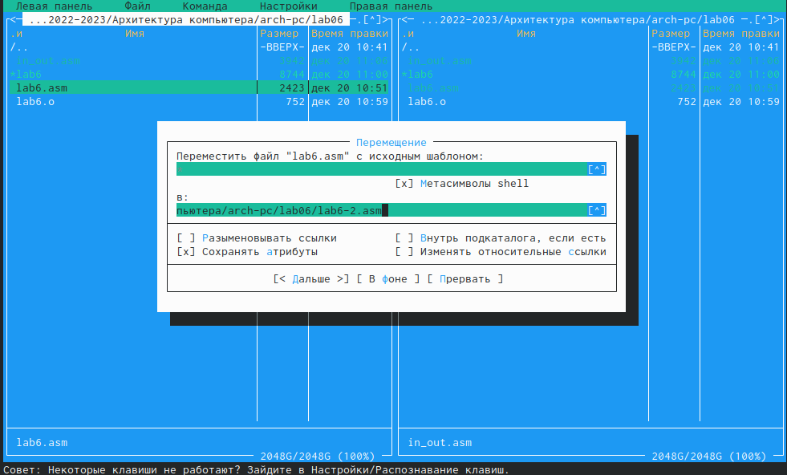
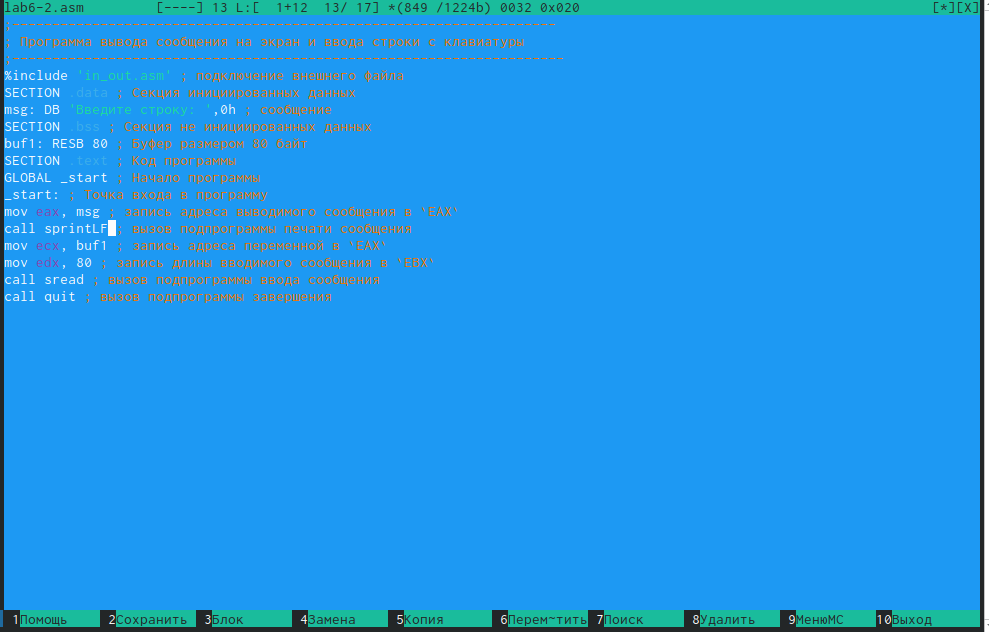

---
## Front matter
title: "Отчёт по лабораторной работе №5"
author: "Ефремова Вера"

## Generic otions
lang: ru-RU
toc-title: "Содержание"

## Bibliography
bibliography: bib/cite.bib
csl: pandoc/csl/gost-r-7-0-5-2008-numeric.csl

## Pdf output format
toc: true # Table of contents
toc-depth: 2
lof: true # List of figures
lot: true # List of tables
fontsize: 12pt
linestretch: 1.5
papersize: a4
documentclass: scrreprt
## I18n polyglossia
polyglossia-lang:
  name: russian
  options:
	- spelling=modern
	- babelshorthands=true
polyglossia-otherlangs:
  name: english
## I18n babel
babel-lang: russian
babel-otherlangs: english
## Fonts
mainfont: PT Serif
romanfont: PT Serif
sansfont: PT Sans
monofont: PT Mono
mainfontoptions: Ligatures=TeX
romanfontoptions: Ligatures=TeX
sansfontoptions: Ligatures=TeX,Scale=MatchLowercase
monofontoptions: Scale=MatchLowercase,Scale=0.9
## Biblatex
biblatex: true
biblio-style: "gost-numeric"
biblatexoptions:
  - parentracker=true
  - backend=biber
  - hyperref=auto
  - language=auto
  - autolang=other*
  - citestyle=gost-numeric
## Pandoc-crossref LaTeX customization
figureTitle: "Рис."
tableTitle: "Таблица"
listingTitle: "Листинг"
lofTitle: "Список иллюстраций"
lotTitle: "Список таблиц"
lolTitle: "Листинги"
## Misc options
indent: true
header-includes:
  - \usepackage{indentfirst}
  - \usepackage{float} # keep figures where there are in the text
  - \floatplacement{figure}{H} # keep figures where there are in the text
---

# Цель работы

Приобретение практических навыков работы в Midnight Commander. Освоение
инструкций языка ассемблера mov и int.

# Выполнение лабораторной работы

1. Откроем Midnight Commander и пользуяшь клавишами откроем каталог ~/work/arch-pc: (рис. [-@fig:001])

{ #fig:001 width=70% }

2. С помощью f7 создадим папку lab06 и перейдем в каталог. С помощью touch создадим файл lab6: (рис. [-@fig:002])

{ #fig:002 width=70% }

3. Откроем файл с помощью текстового редактора mcedit и введём в него текст из листинга: (рис. [-@fig:003])

{ #fig:003 width=70% }

4. С помощью f3 просмотрим созданный файл: (рис. [-@fig:004])

{ #fig:004 width=70% }

5. Оттранслируйте текст программы lab6-1.asm в объектный файл. Выполним компоновку объектного файла и запустим получившийся исполняемый файл. Программа выводит строку 'Введите строку:' и ожидает ввода с
клавиатуры: (рис. [-@fig:005])

{ #fig:005 width=70% }

6. С помощью функциональной клавиши F6 создайте копию файла lab6.asm с именем lab6-2.asm. Выделите файл lab6.asm, нажмите клавишу F6 , введите имя файла lab6-2.asm: (рис. [-@fig:006])

{ #fig:006 width=70% } 

7. Исправьте текст программы в файле lab6-2.asm с использование подпрограмм из внешнего файла in_out.asm (используйте подпрограммы sprintLF, sread и quit) в соответствии с листингом 6.2. Создайте исполняемый файл и проверьте его работу: (рис. [-@fig:007])

{ #fig:007 width=70% }

8. Изменим на sprint: (рис. [-@fig:008])

{ #fig:008 width=70% }

9. Проверим работу двух файлов. Разница в том, что выводы принта выходят на разных строках. (рис. [-@fig:090])

{ #fig:090 width=70% }

# Самостоятельная работа

1. Создадим копию файла lab6.asm с именем lab6-3.asm c первым листингом: (рис. [-@fig:009])

{ #fig:009 width=70% }

2. Запустим файл: (рис. [-@fig:010])

{ #fig:010 width=70% }

3. Создадим копию файла lab6-2.asm с именем lab6-4.asm cо вторым листингом и запустим: (рис. [-@fig:011])

{ #fig:011 width=70% }

4. Загрузим на гитхаб.

# Выводы

Мы приобрели практических навыков работы в Midnight Commander. Освоили
инструкцию языка ассемблера mov и int.

::: {#refs}
:::
