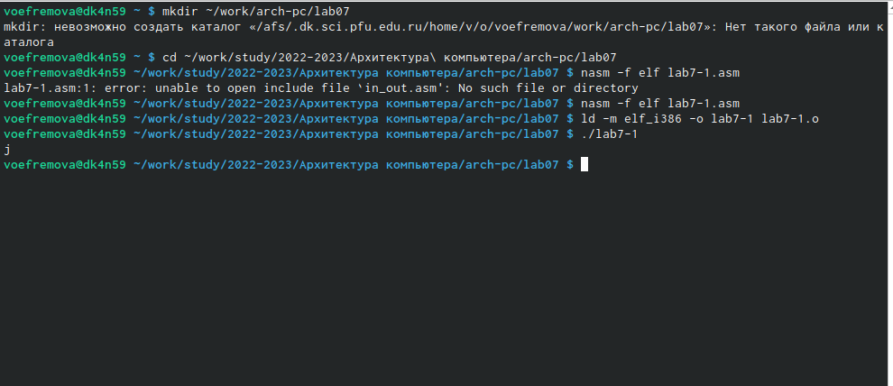
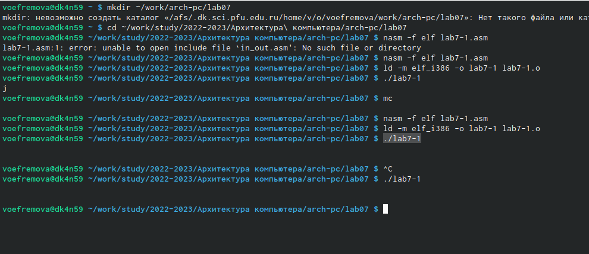

---
## Front matter
title: "Отчёт по лабораторной работе №5"
author: "Ефремова Вера"

## Generic otions
lang: ru-RU
toc-title: "Содержание"

## Bibliography
bibliography: bib/cite.bib
csl: pandoc/csl/gost-r-7-0-5-2008-numeric.csl

## Pdf output format
toc: true # Table of contents
toc-depth: 2
lof: true # List of figures
lot: true # List of tables
fontsize: 12pt
linestretch: 1.5
papersize: a4
documentclass: scrreprt
## I18n polyglossia
polyglossia-lang:
  name: russian
  options:
	- spelling=modern
	- babelshorthands=true
polyglossia-otherlangs:
  name: english
## I18n babel
babel-lang: russian
babel-otherlangs: english
## Fonts
mainfont: PT Serif
romanfont: PT Serif
sansfont: PT Sans
monofont: PT Mono
mainfontoptions: Ligatures=TeX
romanfontoptions: Ligatures=TeX
sansfontoptions: Ligatures=TeX,Scale=MatchLowercase
monofontoptions: Scale=MatchLowercase,Scale=0.9
## Biblatex
biblatex: true
biblio-style: "gost-numeric"
biblatexoptions:
  - parentracker=true
  - backend=biber
  - hyperref=auto
  - language=auto
  - autolang=other*
  - citestyle=gost-numeric
## Pandoc-crossref LaTeX customization
figureTitle: "Рис."
tableTitle: "Таблица"
listingTitle: "Листинг"
lofTitle: "Список иллюстраций"
lotTitle: "Список таблиц"
lolTitle: "Листинги"
## Misc options
indent: true
header-includes:
  - \usepackage{indentfirst}
  - \usepackage{float} # keep figures where there are in the text
  - \floatplacement{figure}{H} # keep figures where there are in the text
---

# Цель работы

Освоить арифметические инструкции языка ассемблера NASM.

# Выполнение лабораторной работы

1. Создаём каталог для 7 лабораторной и создадим файл lab7-1.asm. В него введём текст из листинга 7.1: (рис. [-@fig:001])

{ #fig:001 width=70% }

2. Создадим исполняемый файл и запустим его: (рис. [-@fig:002])

{ #fig:002 width=70% }

3. Изменим текст: (рис. [-@fig:003])

{ #fig:003 width=70% }

4. Создадим исполняемый файл и запустим его. Заметим, что символ не отражается: (рис. [-@fig:004])

{ #fig:004 width=70% }

5. Создадим файл lab7-2.asm и введём в него текст программы из листинга 7.2: (рис. [-@fig:005])

{ #fig:005 width=70% }

6. Запустим исполняемый файл: (рис. [-@fig:006])

{ #fig:006 width=70% } 

7. Заменим функцию iprintLF на iprint. Создайте исполняемый файл и запу-
стите его: (рис. [-@fig:097])

{ #fig:097 width=70% }

8. Создадим файл lab7-3.asm и введем в него текст из листинга 7.3: (рис. [-@fig:008])

{ #fig:008 width=70% }

9. Запустим исполняемый файл. (рис. [-@fig:090])

{ #fig:090 width=70% }

10. Уберем кавычки и запустим программу: (рис. [-@fig:091])

{ #fig:091 width=70% }

11. Создадим файл variant.asm в каталоге и введем туда текст из листинга. Вычислим свой вариант: (рис. [-@fig:092])

{ #fig:092 width=70% }

# Ответы на вопросы

1. Какие строки листинга 7.4 отвечают за вывод на экран сообщения ‘Ваш
вариант:’?
mov eax  and  rem call sprint
2. Для чего используется следующие инструкции? nasm mov ecx, x
mov edx, 80 call sread:
nasm mov ecx, x - запись переменной в регистр ecx
mov edx,80 - запись размера переменной в регистр edx
call sread - вызов функции чтения данных
3. Для чего используется инструкция “call atoi”?
Функция, которая преобразует ascii-код символа в целое число, записывает результат в регистр eax
4. Какие строки листинга 7.4 отвечают за вычисления варианта?
xor edx,edx
mov ebx,20
div ebx
inc edx
5. В какой регистр записывается остаток от деления при выполнении ин-
струкции “div ebx”? ebx
6. Для чего используется инструкция “inc edx”? увеличивает операнду на 1
7. Какие строки листинга 7.4 отвечают за вывод на экран результата вычис-
лений?
mov eax,rem
call sprint 
mov eax,edx
call iprintLF

# Самостоятельная работа

1. Так как выпал вариант 13, то запишем фугкцию для ввода х с клавиатуры. Дальше прописываем все действия и прописываем вывод результата: (рис. [-@fig:009])

{ #fig:009 width=70% }

2. Запустим файл для проверки нашей функции: (рис. [-@fig:010])

{ #fig:010 width=70% }

3. Загрузим на гитхаб.

# Выводы

Освоили арифметические инструкции языка ассемблера NASM.

::: {#refs}
:::
